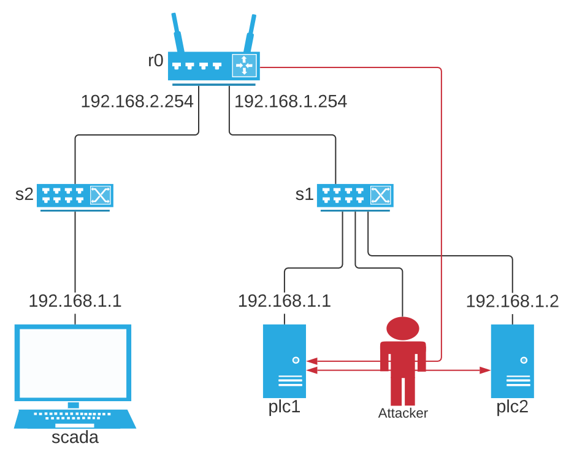
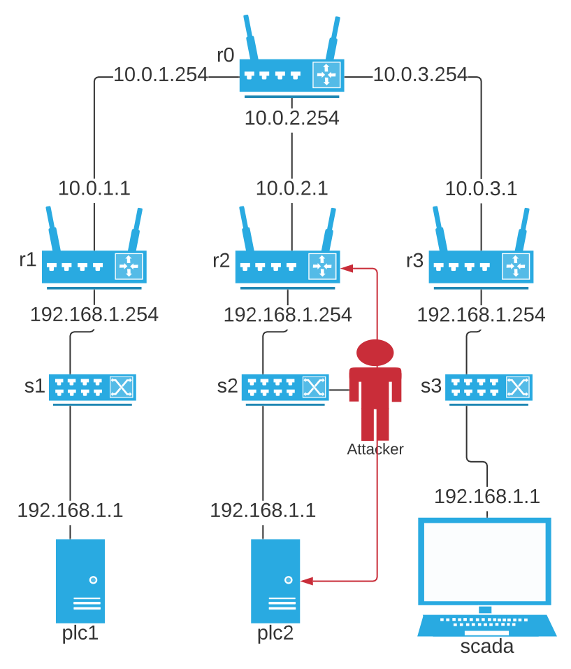

Attacks
=======

DHALSIM has support for device attacks and network attacks. This chapter will explain the configuration for these.

Attacks are an optional and can be configured directly into the experiment .YAML configuration file, or included as a
separate YALM file using the directive

.. code-block:: yaml

   attacks: !include <file>

device attacks
--------------

Device attacks are attacks that are performed at the PLC itself. Imagine it as attacks where the attacker has physical access to the PLC being attacked.

Example:

.. code-block:: yaml

   device_attacks:
     - name: "Close_PRAW1_from_iteration_5_to_10"
       trigger:
         type: time
         start: 5
         end: 10
       actuator: P_RAW1
       command: closed

The following sections will explain the different configuration parameters.

name
~~~~
*This option is required*

This defines the name of the attack. It cannot have whitespaces.

trigger
~~~~~~~~
*This option is required*

This parameter defines when the attack is triggered. There are 4 different types of triggers:

* Timed attacks
    * :code:`time` - This is a timed attack. This means that the attack will start at a given iteration and stop at a given iteration
* Sensor attacks: These are attacks that will be triggered when a certain sensor in the water network meets a certain condition.
    * :code:`below` - This will make the attack trigger while a certain tag is below or equal to a given value
    * :code:`above` - This will make the attack execute while a certain tag is above or equal to a given value
    * :code:`between` - This will ensure that the attack is executed when a certain tag is between or equal to two given values

These are the required parameters per type of trigger:

* For :code:`time` attacks:
    * :code:`start` - The start time of the attack (in iterations).
    * :code:`end` - The end time of the attack (in iterations).
* For :code:`below` and :code:`above` attacks:
    * :code:`sensor` - The sensor of which the value will be used as the trigger.
    * :code:`value` - The value which has to be reached in order to trigger the attack.
* For :code:`between` attacks:
    * :code:`sensor` - The sensor of which the value will be used as the trigger.
    * :code:`lower_value` - The lower bound.
    * :code:`upper_value` - The upper bound.

actuator
~~~~~~~~~
*This option is required*

This parameter defines the actuator on which the :code:`command` should be executed.

command
~~~~~~~
*This option is required*

This parameter defines the command to be executed on the supplied :code:`actuator`. There are two possible commands:

* :code:`open` - Open the actuator
* :code:`closed` - Close the actuator

Examples
~~~~~~~~

Here is an example of a :code:`device_attacks` section in an attack YAML file:

.. code-block:: yaml

    device_attacks:
      - name: "Close_PRAW_from_iteration_5_to_10"
       trigger:
         type: time
         start: 5
         end: 10
       actuator: P_RAW1
       command: closed
      - name: "Close_PRAW1_when_T2_<_0.16"
       trigger:
         type: below
         sensor: T2
         value: 0.16
       actuators: P_RAW1
       command: closed
      - name: "Close_PRAW1_when_0.10_<_T2_<_0.16"
       trigger:
         type: between
         sensor: T2
         lower_value: 0.10
         upper_value: 0.16
       actuators: P_RAW1
       command: closed

network attacks
---------------

Network attacks are attacks where a new node is added to the mininet network topology. This node is an
"attacker" and can perform various attacks on the network. There are mainly two types of network attacks: Man in The Middle Attacks (MiTM) and Denial of Service Attacks (DoS).

The are multiple types of Man in the Middle Attacks:

* Naive Man in the Middle Attacks: This is the most simple attack, it will manipulate all CIP packets going through a network link, regardless of the tag (value of sensor/actuator) that the package includes

* Man in the Middle: This attack allows the user to configure a list of tags that will be manipulated. The attacker will not manipulate tags not present in the list that travel through the network link.

* Server Man in the Middle: This attack causes the attacker to launch a CIP server and then serve the target using that server. It will create a new TCP connection and ENIP session between the attacker and the victim.

* Concealment Man in the Middle: This attack differentiates from the traffic going to a PLC and to the SCADA server. For the PLC, it will manipulate the tag values with the attack values. For the SCADA, it will manipulate the tag values with the concealment values.

These are explained in the following sections.

Naive Man-in-the-middle Attack
~~~~~~~~~~~~~~~~~~~~~~~~~~~~~~~~~

Naive Man-in-the-middle (MITM) attacks are attacks where the attacker will sit in between a PLC and its connected switch. The attacker will then modify the values of all tags in the CIP packets to the other PLCs.

    A simple topology with an attacker

    A complex topology with an attacker

This is an example of a :code:`naive_mitm` attack definition:

.. code-block:: yaml

   network_attacks:
     name: "test1"
     type: naive_mitm
     trigger:
       type: time
       start: 5
       end: 10
     value: 0.2
     target: PLC1
     direction: destination

The following sections will explain the configuration parameters.

name
^^^^^^^^^^^^^^^^^^^^^^^^^
*This option is required*

This defines the name of the attack. It is also used as the name of the attacker node on the mininet network.
The name can only contain the the characters :code:`a-z`, :code:`A-Z`, :code:`0-9` and :code:`_`. And
must have a length between 1 and 10 characters.

type
^^^^^^^^^^^^^^^^^^^^^^^^^
*This option is required*

This defines the type of network attack. For a Naive MITM attack, this should be :code:`naive_mitm`.

trigger
^^^^^^^^^^^^^^^^^^^^^^^^^
*This option is required*

This parameter defines when the attack is triggered. There are 4 different types of triggers:

* Timed attacks
    * :code:`time` - This is a timed attack. This means that the attack will start at a given iteration and stop at a
given iteration
* Sensor attacks: These are attacks that will be triggered when a certain sensor in the water network meets a certain
condition.
    * :code:`below` - This will make the attack trigger while a certain tag is below or equal to a given value
    * :code:`above` - This will make the attack execute while a certain tag is above or equal to a given value
    * :code:`between` - This will ensure that the attack is executed when a certain tag is between or equal to two given
values

These are the required parameters per type of trigger:

* For :code:`time` attacks:
    * :code:`start` - The start time of the attack (in iterations).
    * :code:`end` - The end time of the attack (in iterations).
* For :code:`below` and :code:`above` attacks:
    * :code:`sensor` - The sensor of which the value will be used as the trigger.
    * :code:`value` - The value which has to be reached in order to trigger the attack.
* For :code:`between` attacks:
    * :code:`sensor` - The sensor of which the value will be used as the trigger.
    * :code:`lower_value` - The lower bound.
    * :code:`upper_value` - The upper bound.

value/offset
^^^^^^^^^^^^^^^^
*One of these options is required*

If you want to overwrite everything with an absolute value, use the :code:`value` option, and set it to the desired
value.
If you want to overwrite everything with a relative value, use the :code:`offset` option, and set it to the desired
offset.

target
^^^^^^^^^^^^^^^^^^^^^^^^^
*This option is required*

This will define the target of the network attack. For a MITM attack, this is the PLC at which the attacker will sit.

direction
^^^^^^^^^^^^^^^^^^^^^^^^^
*This an optional parameter*

This will define the direction of the communication that we are launching the MiTM attack. Messages can be intercepted
if the target is the "source" or "destination" of the messages. The valid values for this parameter are "source" and
"destionation", the default value is "source"

Man-in-the-middle Attack
~~~~~~~~~~~~~~~~~~~~~~~~~~~~~~~~~
Man-in-the-middle (MITM) attacks are attacks where the attacker will sit in between a PLC and its
connected switch. The attacker will parse the CIP packets and if they are in the configured target list, it will modify
the value of the tags to the other PLCs.

    A simple topology with an attacker

    A complex topology with an attacker

This is an example of a :code:`mitm` attack definition:

.. code-block:: yaml

   network_attacks:
     name: "test1"
     type: mitm
     trigger:
       type: time
       start: 5
       end: 10
     value: 0.2
     target: PLC1
     direction: destination

The following sections will explain the configuration parameters.

name
^^^^^^^^^^^^^^^^^^^^^^^^^
*This option is required*

This defines the name of the attack. It is also used as the name of the attacker node on the mininet network.
The name can only contain the the characters :code:`a-z`, :code:`A-Z`, :code:`0-9` and :code:`_`. And
must have a length between 1 and 10 characters.

type
^^^^^^^^^^^^^^^^^^^^^^^^^
*This option is required*

This defines the type of network attack. For an MITM attack, this should be :code:`mitm`.

trigger
^^^^^^^^^^^^^^^^^^^^^^^^^
*This option is required*

This parameter defines when the attack is triggered. There are 4 different types of triggers:

* Timed attacks
    * :code:`time` - This is a timed attack. This means that the attack will start at a given iteration and stop at a
given iteration
* Sensor attacks: These are attacks that will be triggered when a certain sensor in the water network meets a certain
condition.
    * :code:`below` - This will make the attack trigger while a certain tag is below or equal to a given value
    * :code:`above` - This will make the attack execute while a certain tag is above or equal to a given value
    * :code:`between` - This will ensure that the attack is executed when a certain tag is between or equal to two given
values

These are the required parameters per type of trigger:

* For :code:`time` attacks:
    * :code:`start` - The start time of the attack (in iterations).
    * :code:`end` - The end time of the attack (in iterations).
* For :code:`below` and :code:`above` attacks:
    * :code:`sensor` - The sensor of which the value will be used as the trigger.
    * :code:`value` - The value which has to be reached in order to trigger the attack.
* For :code:`between` attacks:
    * :code:`sensor` - The sensor of which the value will be used as the trigger.
    * :code:`lower_value` - The lower bound.
    * :code:`upper_value` - The upper bound.

value/offset
^^^^^^^^^^^^^^^^
*One of these options is required*

If you want to overwrite everything with an absolute value, use the :code:`value` option, and set it to the desired
value.
If you want to overwrite everything with a relative value, use the :code:`offset` option, and set it to the desired
offset.

target
^^^^^^^^^^^^^^^^^^^^^^^^^
*This option is required*

This will define the target of the network attack. For a MITM attack, this is the PLC at which the attacker will sit.

tag
^^^^^^^^^^^^^^^^^^^^^^^^^
*This option is required*

This defines the tag that will be spoofed in an MITM attack.

For example, to overwrite the value of T1:

.. code-block:: yaml

   tags:
     - tag: T1
       value: 0.12

Or instead, to offset the value of T1:

.. code-block:: yaml

   tags:
     - tag: T1
       offset: -0.2

Server Man-in-the-middle Attack
~~~~~~~~~~~~~~~~~~~~~~~~~~~~~
Man-in-the-middle (MITM) attacks are attacks where the attacker will sit in between a PLC and its
connected switch. In this attack, the attacker will then route host a CPPPO server and respond to the CIP requests
for the PLC.

    A simple topology with an attacker

    A complex topology with an attacker

This is an example of a :code:`server_mitm` attack definition:

.. code-block:: yaml

   network_attacks:
     - name: attack1
       type: server_mitm
       trigger:
         type: time
         start: 5
         end: 10
       tags:
         - tag: T0
           value: 0.1
         - tag: T2
           value: 0.2
       target: PLC1

The following sections will explain the configuration parameters.

name
^^^^^^^^^^^^^^^^^^^^^^^^^
*This option is required*

This defines the name of the attack. It is also used as the name of the attacker node on the mininet network.
The name can only contain the the characters :code:`a-z`, :code:`A-Z`, :code:`0-9` and :code:`_`. And
must have a length between 1 and 10 characters.

type
^^^^^^^^^^^^^^^^^^^^^^^^^
*This option is required*

This defines the type of network attack. For a Server MITM attack, this should be :code:`server_mitm`.

trigger
^^^^^^^^^^^^^^^^^^^^^^^^^
*This option is required*

This parameter defines when the attack is triggered. There are 4 different types of triggers:

* Timed attacks
    * :code:`time` - This is a timed attack. This means that the attack will start at a given iteration and stop at a
given iteration
* Sensor attacks: These are attacks that will be triggered when a certain sensor in the water network meets a certain
condition.
    * :code:`below` - This will make the attack trigger while a certain tag is below or equal to a given value
    * :code:`above` - This will make the attack execute while a certain tag is above or equal to a given value
    * :code:`between` - This will ensure that the attack is executed when a certain tag is between or equal to two given
values

These are the required parameters per type of trigger:

* For :code:`time` attacks:
    * :code:`start` - The start time of the attack (in iterations).
    * :code:`end` - The end time of the attack (in iterations).
* For :code:`below` and :code:`above` attacks:
    * :code:`sensor` - The sensor of which the value will be used as the trigger.
    * :code:`value` - The value which has to be reached in order to trigger the attack.
* For :code:`between` attacks:
    * :code:`sensor` - The sensor of which the value will be used as the trigger.
    * :code:`lower_value` - The lower bound.
    * :code:`upper_value` - The upper bound.

tags
^^^^^^^^^^^^^^^^^^^^^^^^^
*This option is required*

This defines the tags that will be spoofed in a server MITM attack. It contains a list of "tuples" defining the tag and
the corresponding value or offset.

For example, to overwrite the value of T1:

.. code-block:: yaml

   tags:
     - tag: T1
       value: 0.12

Or instead, to offset the value of T1:

.. code-block:: yaml

   tags:
     - tag: T1
       offset: -0.2

target
^^^^^^^^^^^^^^^^^^^^^^^^^
*This option is required*

This will define the target of the network attack. For a server MITM attack, this is the PLC at which the attacker will
sit.

Concealment Man-in-the-middle Attack
~~~~~~~~~~~~~~~~~~~~~~~~~~~~~
In this MiTM attack, the attacker will differentiate between traffic with PLC as a destination and traffic with a SCADA
server as destination. If the destination is a PLC, the attacker will modify the tag values with the configured attack
values. If the destination is a SCADA server, the attacker will modify the tag values with the configured concealment
values.

name
^^^^^^^^^^^^^^^^^^^^^^^^^
*This option is required*

This defines the name of the attack. It is also used as the name of the attacker node on the mininet network.
The name can only contain the the characters :code:`a-z`, :code:`A-Z`, :code:`0-9` and :code:`_`. And
must have a length between 1 and 10 characters.

type
^^^^^^^^^^^^^^^^^^^^^^^^^
*This option is required*

This defines the type of network attack. For a Concealment MITM attack, this should be :code:`concealment_mitm`.

trigger
^^^^^^^^^^^^^^^^^^^^^^^^^
*This option is required*

This parameter defines when the attack is triggered. There are 4 different types of triggers:

* Timed attacks
    * :code:`time` - This is a timed attack. This means that the attack will start at a given iteration and stop at a
given iteration
* Sensor attacks: These are attacks that will be triggered when a certain sensor in the water network meets a certain
condition.
    * :code:`below` - This will make the attack trigger while a certain tag is below or equal to a given value
    * :code:`above` - This will make the attack execute while a certain tag is above or equal to a given value
    * :code:`between` - This will ensure that the attack is executed when a certain tag is between or equal to two given
values

These are the required parameters per type of trigger:

* For :code:`time` attacks:
    * :code:`start` - The start time of the attack (in iterations).
    * :code:`end` - The end time of the attack (in iterations).
* For :code:`below` and :code:`above` attacks:
    * :code:`sensor` - The sensor of which the value will be used as the trigger.
    * :code:`value` - The value which has to be reached in order to trigger the attack.
* For :code:`between` attacks:
    * :code:`sensor` - The sensor of which the value will be used as the trigger.
    * :code:`lower_value` - The lower bound.
    * :code:`upper_value` - The upper bound.

value/offset
^^^^^^^^^^^^^^^^
*One of these options is required*

If you want to overwrite everything with an absolute value, use the :code:`value` option, and set it to the desired
value.
If you want to overwrite everything with a relative value, use the :code:`offset` option, and set it to the desired
offset.

target
^^^^^^^^^^^^^^^^^^^^^^^^^
*This option is required*

This will define the target of the network attack. For a MITM attack, this is the PLC at which the attacker will sit.

tags
^^^^^^^^^^^^^^^^^^^^^^^^^
*This option is required*

This defines the tags that will be spoofed in a server MITM attack. It contains a list of "tuples" defining the tag and
the corresponding value or offset.

For example, to overwrite the values of T1, T2, T3:

.. code-block:: yaml

   tags:
     - tag: T1
       value: 0.12
     - tag: T2
       value: 0.15
     - tag: T3
       value: 0.20

Or instead, to offset the value of T1:

.. code-block:: yaml

   tags:
     - tag: T1
       offset: 0.12
     - tag: T2
       offset: 0.15
     - tag: T3
       offset: 0.20

concealment_data
^^^^^^^^^^^^^^^^^^^^^^^^^
*This option is required*

This option configures the type of concealment and the values of the concealment. There are 2 types of concealment data
available:

* Path: This option is used to define a path to a .csv file with the concealment values for each tag. The format of this
.csv requires that the first column is the iteration number when the concealment will be applied and the subsequent
columns represent the concealmente values. The name of the first row must be "Iteration" and each subsequent column must
have the tag name.
* Value: This option is used to define specific values to be used during the entire attack. The values can be configured
as absolute values or as offset.

For example, to conceal the values of T3, T4:
  concealment_data:
    type: value
    concealment_value:
      - tag: T3
        value: 42.0
      - tag: T4
        value: 84.0

Simple Denial of Service Attack
~~~~~~~~~~~~~~~~~~~~~~~~~~~~~
This attack interrupts the flow of CIP messages containing data between PLCs. This attack first performs an ARP Spoofing
attack into the target and then stops forwarding the CIP messages. This will cause the PLCs to be unable to update their
cache with new system state information. Possibly taking wrong control action decisions.

This is an example of a :code:`simple_dos` attack definition:

.. code-block:: yaml

    network_attacks:
        - name: plc1attack
          target: PLC2
          trigger:
            type: time
            start: 648
            end: 936
          type: simple_dos
          direction: source

The following sections will explain the configuration parameters.

name
^^^^^^^^^^^^^^^^^^^^^^^^^
*This option is required*

This defines the name of the attack. It is also used as the name of the attacker node on the mininet network.
The name can only contain the the characters :code:`a-z`, :code:`A-Z`, :code:`0-9` and :code:`_`. And
must have a length between 1 and 10 characters.

trigger
^^^^^^^^^^^^^^^^^^^^^^^^^
*This option is required*

This parameter defines when the attack is triggered. There are 4 different types of triggers:

* Timed attacks
    * :code:`time` - This is a timed attack. This means that the attack will start at a given iteration and stop at a
given iteration
* Sensor attacks: These are attacks that will be triggered when a certain sensor in the water network meets a certain
condition.
    * :code:`below` - This will make the attack trigger while a certain tag is below or equal to a given value
    * :code:`above` - This will make the attack execute while a certain tag is above or equal to a given value
    * :code:`between` - This will ensure that the attack is executed when a certain tag is between or equal to two given
values

These are the required parameters per type of trigger:

* For :code:`time` attacks:
    * :code:`start` - The start time of the attack (in iterations).
    * :code:`end` - The end time of the attack (in iterations).
* For :code:`below` and :code:`above` attacks:
    * :code:`sensor` - The sensor of which the value will be used as the trigger.
    * :code:`value` - The value which has to be reached in order to trigger the attack.
* For :code:`between` attacks:
    * :code:`sensor` - The sensor of which the value will be used as the trigger.
    * :code:`lower_value` - The lower bound.
    * :code:`upper_value` - The upper bound.

target
^^^^^^^^^^^^^^^^^^^^^^^^^
*This option is required*

This will define the target of the network attack. For a MITM attack, this is the PLC at which the attacker will sit.

direction
^^^^^^^^^^^^^^^^^^^^^^^^^
*This an optional parameter*

This will define the direction of the communication that we are launching the MiTM attack. Messages can be intercepted
if the target is the "source" or "destination" of the messages. The valid values for this parameter are "source" and
"destionation", the default value is "source"