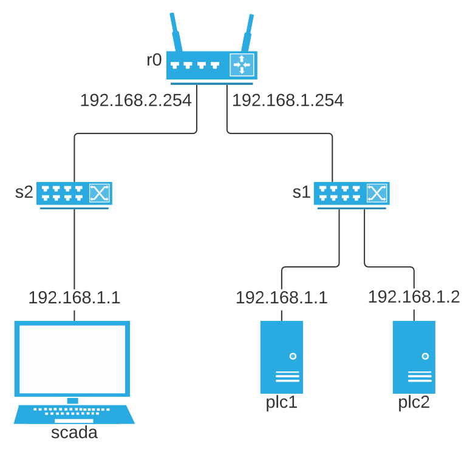
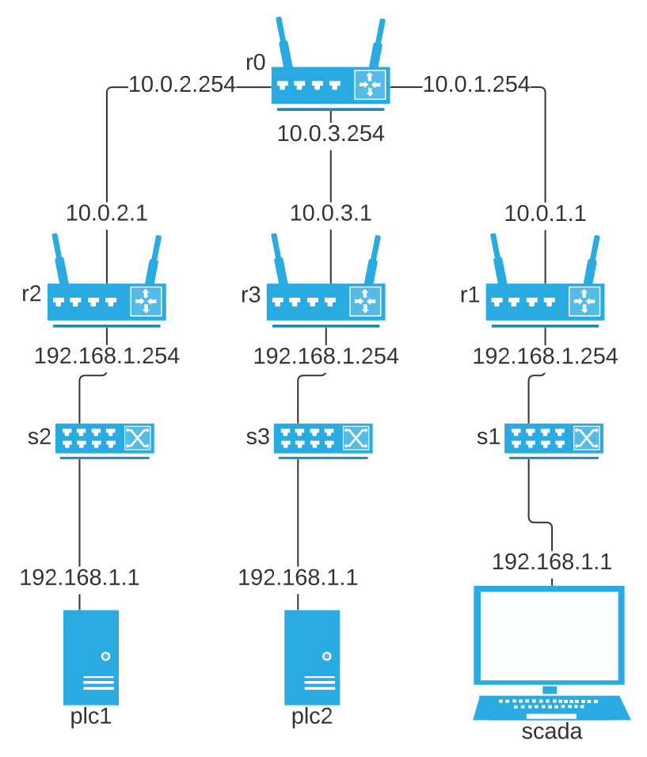

Configuration
=======================

To run DHALSIM, you will need a configuration yaml file. In this chapter every parameter is explained.

Example with all options:

.. code-block:: yaml

    inp_file: map.inp

    plcs:
      - name: PLC1
        sensors:
          - Tank1
          - Junction5
          - Pump2F
        actuators:
          - Pump1
          - Valve1
      - name: PLC2
        sensors:
          - Tank2
          - Valve2F
        actuators:
          - Valve2

    network_topology_type: complex
    output_path: output
    iterations: 500
    mininet_cli: False
    log_level: info
    simulator: pdd
    batch_simulations: 20
    initial_tank_data: initial_tank.csv
    demand_patterns: demand_patterns/
    network_loss_data: losses.csv
    network_delay_data: delays.csv

    attacks:
      device_attacks:
        - name: attack1
          trigger:
            type: time
            start: 5
            end: 10
          actuator: Pump1
          command: closed

      network_attacks:
        - name: attack2
          type: mitm
          trigger:
            type: above
            sensor: Valve2F
            value: 0.16
          tags:
            - tag: Tank2
              value: 2.0
          target: PLC2
        - name: attack3
          type: naive_mitm
          trigger:
            type: between
            sensor: Tank1
            lower_value: 0.10
            upper_value: 0.16
          value: 0.5
          target: PLC1

In the following sections, every entry is explained.

inp_file
------------------------
*This option is required*

The inp file is the file used primarily in the EPANET water simulation, it stores the description of the water network
along with simulation values such as duration; and control rules for valves, pumps, etc.

The :code:`inp_file` option should be the path to the inp file to use in the experiment.
This can be either a absolute path, or relative to the configuration file.

plcs
------------------------
*This option is required*

The :code:`plcs` section is one of the mandatory options for DHALSIM. It defines what PLCs are in the network, and which sensors/actuators
those PLCs control. :code:`plcs` is a list of PLCs. A PLC has the following format:

.. code-block:: yaml

  - name: plc_name
    sensors:
      - sensor_1
      - sensor_2
    actuators:
      - actuator_1
      - actuator_2

The :code:`name`, :code:`sensors` and :code:`actuators` can only contain the the characters :code:`a-z`, :code:`A-Z`, :code:`0-9` and :code:`_`.

If you want to put the PLCs in a separate file, see the section :ref:`PLCs in a separate file`.

sensors
~~~~~~~~~~~~
Sensors can be one of the following types:

* Tank level
    * Use the tank name from the :code:`.inp` file.
* Junction pressure
    * Use the junction name from the :code:`.inp` file.
* Valve flow
    * Use the valve name from the :code:`.inp` file + :code:`F`. Example: :code:`V3F`.
* Pump flow
    * Use the pump name from the :code:`.inp` file + :code:`F`. Example: :code:`P2F`.

actuators
~~~~~~~~~~~~
Actuators can be one of the following types:

* Valve status
    * Use the valve name from the :code:`.inp` file.
* Pump status
    * Use the pump name from the :code:`.inp` file.

network_topology_type
--------------------------------
*This option is required*

This option represents the mininet network topology that will be used. It has two options, :code:`simple` and :code:`complex`.

If you use the :code:`simple` option, then a network topology will be generated that has all of the PLCs and the SCADA in one
local network. The PLCs connect to one switch and the SCADA to another, and those switches then connect to one router.

    Diagram of simple topology

If you use the :code:`complex` option then a network topology will be generated that has all of the PLCs and the SCADA in their
own independent network. They will all have a switch and a router, these then connect to a central router through their public ip
addresses. This makes testing of attacks such as man in the middle more realistic.

    Diagram of complex topology

output_path
------------------------
*This is an optional value with default*: :code:`output`

This option represents the path to the folder in which output files (.pcap, .csv, etc.) will be
created. The default is output and the path is relative to the configuration file.

Note: if you run in batch mode, subfolders will automatically be created of the form :code:`output_path/batch_number`

iterations
------------------------
*This is an optional value with default*: duration / hydraulic time-step

The iterations value represents for how many iterations you would like the water simulation to run.
One iteration represents one hydraulic time-step.

mininet_cli
------------------------
*This is an optional value with default*: :code:`False`

If the :code:`mininet_cli` option is :code:`True`, then after the network is setup, the mininet CLI interface will start.
See the `mininet tutorial on the CLI <http://mininet.org/walkthrough/#part-3-mininet-command-line-interface-cli-commands>`_ for more information

:code:`mininet_cli` should be a boolean.

log_level
------------------------
*This is an optional value with default*: :code:`info`

DHALSIM uses Python's built-in :code:`logging` module to log events. Using the `log_level` attribute in the configuration file, one can change the severity level of events that should be reported by DHALSIM. There are five different logging levels that are accepted, with each logging level also printing the logs of a higher priority. For example, setting `log_level` to `warning`, will log all `warning`, `error`, and `critical` statements to the console.

* :code:`debug`
    * Debug is a special kind of logging level: this will print all debug statements of DHALSIM, as well as all logs printed by MiniCPS and mininet. Since MiniCPS uses print statements as their logging system, MiniCPS will not be able to make use of our logging system.
* :code:`info`
    * Info will log DHALSIM info statements to the console. This is the default value for log_level and is recommended for normal use of DHALSIM.
* :code:`warning`
* :code:`error`
* :code:`critical`
    * Critical errors are errors that make DHALSIM crash. This will always be logged to the console.

simulator
------------------------
*This is an optional value with default*: :code:`PDD`

The simulator option in the config file represents the demand model used by the WNTR simulation.
The valid options are :code:`PDD` and :code:`DD`. This value is then passed to the
`WNTR hydraulic demand model option <https://wntr.readthedocs.io/en/latest/hydraulics.html>`_.

batch_simulations
------------------------
*This is an optional value*

If the :code:`batch_simulations` option is set, then the simulation will be running in batch mode. This means you can provide :code:`.csv`
files with initial tank conditions, demand patterns, and network losses/delays to run simulations under different conditions. The full simulation will run
:code:`batch_simulations` number of times with output going to :code:`output_path/batch_number` folders.

Note: the :code:`.csv` files (besides demand patterns) you provide should have at least :code:`batch_simulations` rows.

:code:`batch_simulations` should be a number.

saving_interval
------------------------
*This is an optional value*

When this option is set with value, the simulation will save the :code:`ground_truth.csv` and :code:`scada_values.csv` files
every x iterations, where x is the value set.

:code:`saving_interval` should be an integer greater than 0.

initial_tank_data
------------------------
*This is an optional value*

The :code:`initial_tank_data` field provides the name of the :code:`.csv` files with initial tank values for a simulation. Each column should be a tank
with rows being initial values. If you run in batch mode, then it will use the row corresponding to the number of the simulation (e.g. for simulation 3 it will
use the column with index 3); if you do not run in batch mode then it will use the first row (row 0).If you want to only provide initial values for some tanks,
then you can do so and the remaining tanks will use the default initial value from the :code:`.inp` file.

An example would look like this :

.. csv-table:: initial_tank_data
   :header: "tank_1", "tank_2", "tank_3"
   :widths: 5, 5, 5

    1.02,2.45,3.17
    4.02,5.45,6.17
    7.02,8.45,9.17

demand_patterns
------------------------
*This is an optional value*

The :code:`demand_patterns` field provides the path to demand pattern :code:`.csv` file(s) used in a simulation. If you aren't using batch mode, then this can just be the path to
the file location (e.g. :code:`demand_patterns: demands.csv`). If you are running with batch mode the :code:`.csv` file must follow the name convention :code:`number.csv` where :code:`number`
is the number of the batch for which you want those demand patterns to be used. For example for the first batch you would have :code:`0.csv`, then :code:`1.csv`, etc. And the :code:`demand_patterns`
value will be the *path* to the location of your demand pattern files (e.g. :code:`demand_patterns: demand_patterns/` where demand_patterns is a folder containing the :code:`number.csv` files).

The :code:`.csv` will contain the consumer name as the header, with the different demand values for the simulation as the rows

An example would look like this :

.. csv-table:: initial_demand_patterns
   :header: "Consumer01", "Consumer02"
   :widths: 10, 10

    21.02,28.45
    42.02,55.45
    17.02,18.45

network_loss_data
------------------------
*This is an optional value*

The :code:`network_loss_data` field provides the name of the :code:`.csv` file with network loss values for the simulation.
If the :code:`network_loss_data` field is provided, then the network simulation will run using network losses. This means you can provide a :code:`.csv`
file with network losses to simulate under non-perfect network conditions. If you aren't running DHALSIM in batch mode, then the network losses used will be the first
row in the CSV. If you are running DHALSIM in batch mode, then it will use the same index as the tank levels, demand patterns, etc (i.e. the row corresponding to the current
batch, so for batch 5 it will use the 5th data row).

If the :code:`network_loss_data` field is not provided, then the simulation will run without network losses (0% packet loss).

Each column of the :code:`.csv` file should be a plc/scada with rows being the loss values (where each value is a percentage from 0-100).
If you want to only provide losses for some nodes, then you can do that and the remaining nodes will use the default value (none). Note
that the plc name must be the same as in the :code:`plcs` section, and the scada name must be 'scada'.

An example would look like this :

.. csv-table:: network_loss_data
   :header: "PLC1", "PLC2", "scada"
   :widths: 5, 5, 5

    0.02,0.45,0.17
    0.03,0.46,0.18
    0.04,0.47,0.19

network_delay_data
------------------------
*This is an optional value*

The :code:`network_delay_data` field provides the name of the :code:`.csv` file with network delay values for the simulation.
If the :code:`network_delay_data` option is provided, then the network simulation will run using network delays. This means you can provide a :code:`.csv`
file with network delays to simulate under non-perfect network conditions. If you aren't running DHALSIM in batch mode, then the network delays used will be the first
row in the CSV. If you are running DHALSIM in batch mode, then it will use the same index as the tank levels, demand patterns, etc (i.e. the row corresponding to the current
batch, so for batch 5 it will use the 5th data row).

If the :code:`network_delay_data` field is not provided, then the simulation will run without network delays (0ms delay).

Each column should be a plc/scada with rows being the delay values (where each value is the delay in milliseconds).
If you want to only provide delays for some nodes, then you can do that and the remaining
nodes will use the default value (none).

Note that the plc name must be the same as in the :code:`plcs` section, and the scada name must be 'scada'.

An example would look like this :

.. csv-table:: network_delay_data
   :header: "PLC1", "PLC2", "scada"
   :widths: 5, 5, 5

    22.02,42.45,17.17
    22.03,42.46,17.18
    22.04,42.47,17.19

attacks
------------------------
*This is an optional value*

There are multiple types of attack available. They are described in the :ref:`Attacks` section.
If this option is left out, or commented out, the simulation will run without attacks.

If you want to put the attacks in a separate file, see the section :ref:`Attacks in a separate file`.

Splitting up the config file
==============================
If you want easily swap out the attacks for other attacks, or swap out the PLCs, you can split up your configuration file into multiple files.
This is done using the :code:`!include` keyword.

Here follow a few examples:

PLCs in a separate file
------------------------

If you would like to have your :code:`plcs` stored in a separate yaml file, that is possible by including
it by using :code:`!include`.

This would be in the config file:

.. code-block:: yaml

    plcs: !include plcs.yaml

And the :code:`plcs.yaml` would look like:

.. code-block:: yaml

  - name: PLC1
    sensors:
      - Tank1
      - Junction5
      - Pump2F
    actuators:
      - Pump1
      - Valve1
  - name: PLC2
    sensors:
      - Tank2
      - Valve2F
    actuators:
      - Valve2

Attacks in a separate file
----------------------------

If you would like to have your :code:`attacks` stored in a separate yaml file, that is possible by including
it by using :code:`!include`.

This would be in the config file:

.. code-block:: yaml

    attacks: !include attacks.yaml

And the :code:`attacks.yaml` would look like:

.. code-block:: yaml

   device_attacks:
     - name: attack1
       trigger:
         type: time
         start: 5
         end: 10
       actuator: Pump1
       command: closed

   network_attacks:
     - name: attack2
       type: mitm
       trigger:
         type: above
         sensor: Valve2F
         value: 0.16
       tags:
         - tag: Tank2
           value: 2.0
       target: PLC2
     - name: attack3
       type: naive_mitm
       trigger:
         type: between
         sensor: Tank1
         lower_value: 0.10
         upper_value: 0.16
       value: 0.5
       target: PLC1
